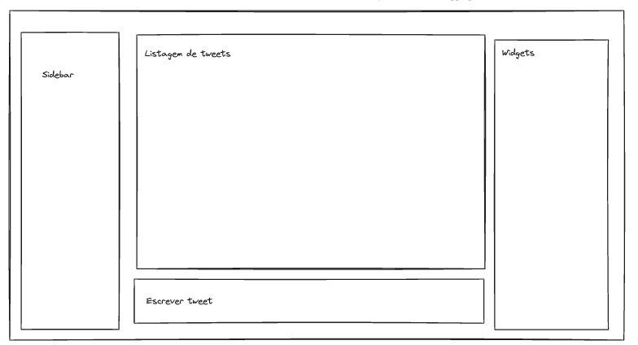
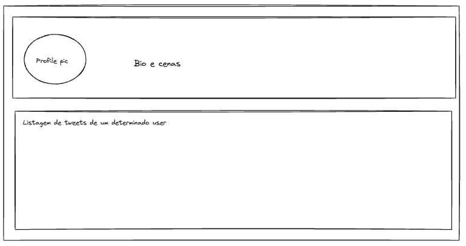

# Phase 1

**Application:** SocialNet

**Description:** a social network similiar to X (formerly Twitter).

- [Phase 1](#phase-1)
  - [Design](#design)
    - [Application Requirements](#application-requirements)
    - [Domain Model](#domain-model)
  - [Technological Decisions](#technological-decisions)
    - [Technological stack](#technological-stack)
    - [Infrastructure](#infrastructure)
  - [Security Analysis](#security-analysis)
    - [Threat Model](#threat-model)
    - [ASVS Checklist](#asvs-checklist)

## Design

### Application Requirements

1. A Frontend
2. A Backend
3. A Database
4. An Authentication System
5. At least 3 aggregates in the domain model
6. Follow the Secure Systems Development Lifecycle (SSDLC) process

Here are the mockups for the frontend application:

### Domain Model

We are using PlantUML to design our Domain Model, with the first iteration being the following:

We have the following agregates with the following entities:

- Authentication: `Users`, `Roles` and `User-Related Information`
- Tweets: `Tweets` and Tweet `Replies`
- Hashtags: `Hashtags` and `Hashtag Statistics`

The entity `MediaAttachment` is reusable by the various aggregates.

## Technological Decisions

### Technological stack

- [Python3 (3.12)](https://www.python.org/downloads/release/python-3120/) for the Backend
- [ReactJS](https://react.dev/) for the Frontend
- [Supabase](https://supabase.com/docs) (with the [Python Client](https://supabase.com/docs/reference/python/start)) for Authentication and Authorization
- [Cloudflare Tunnels](https://developers.cloudflare.com/cloudflare-one/connections/connect-networks/) to expose the application (custom domain to be defined)
- [Postgres](https://www.postgresql.org/) as the database engine

### Infrastructure

## Security Analysis

### Threat Model

We have modeled our domain and infrastructure on Threat Dragon and the Model is present at the folder [`threat-dragon`](threat-dragon).

The full report, with the security analysis for each infrastructure component, as well as the security analysis for the relationships between our domain entities is present at [`threat-analysis.pdf`](threat-dragon/threat-analysis.pdf).

### ASVS Checklist

Here are the results for the ASVS Checklist for this iteration.

Please note that this is an ongoing process and certain entries marked as `Not Applicable` will be handled in Phase 2.

Full checklist available at [`asvs`](asvs)