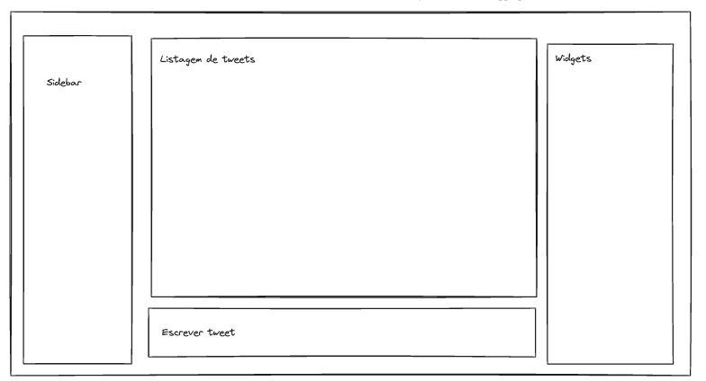
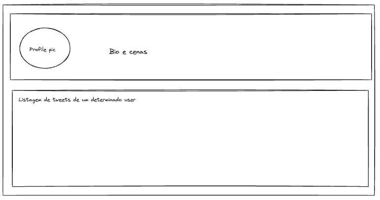
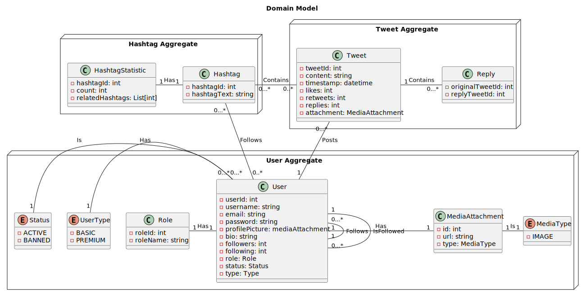
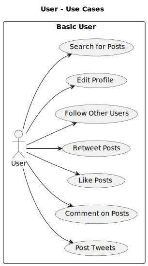
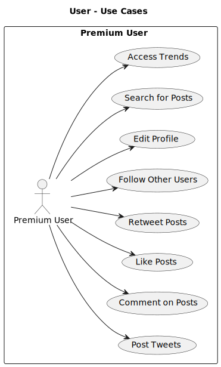
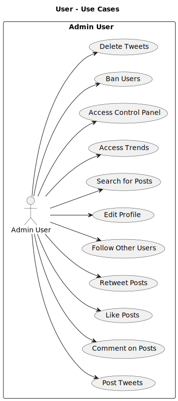
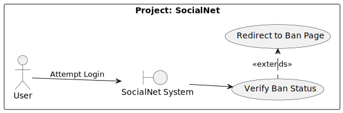
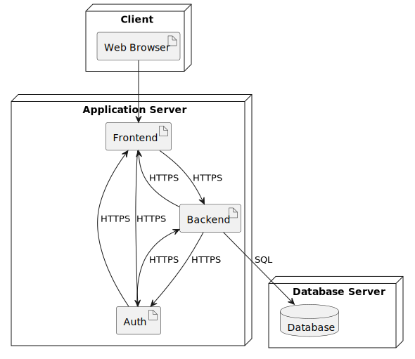
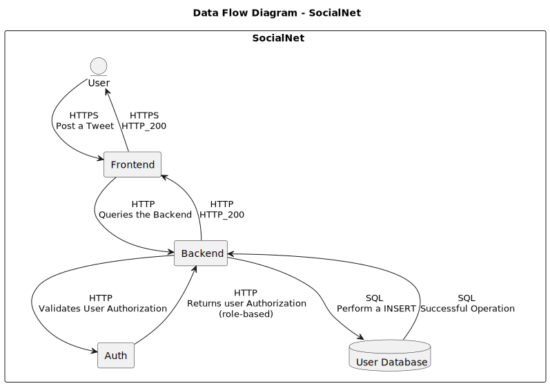
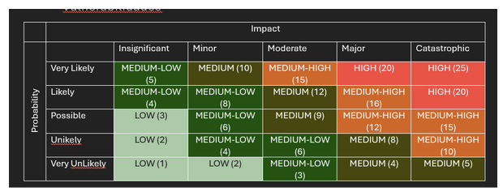

# Phase 1

**Application:** SocialNet

**Description:** a social network similiar to X (formerly Twitter).

- [Phase 1](#phase-1)
  - [Design](#design)
    - [Application Requirements](#application-requirements)
    - [Domain Model](#domain-model)
    - [Use Cases](#use-cases)
      - [User and Premium User](#user-and-premium-user)
      - [Tweet Interaction](#tweet-interaction)
      - [Banned Users](#banned-users)
  - [Implementation](#implementation)
  - [Technological Decisions](#technological-decisions)
    - [Tech-Stack](#tech-stack)
    - [Infrastructure - High-Level System Architecture Diagram](#infrastructure---high-level-system-architecture-diagram)
  - [Security Analysis](#security-analysis)
    - [Security Requirements](#security-requirements)
    - [Threat Model](#threat-model)
    - [ASVS Checklist](#asvs-checklist)
  - [Test Plan](#test-plan)

## Design

### Application Requirements

1. A Frontend
2. A Backend
3. A Database
4. An Authentication System (with at least 3 roles)
5. At least 3 aggregates in the domain model
6. Follow the Secure Systems Development Lifecycle (SSDLC) process

Here are the mockups for the frontend application:

### Domain Model

We are using PlantUML to design our Domain Model, with the first iteration being the following:

We have the following agregates with the following entities:

- Authentication: `Users`, `Roles` and `User-Related Information`
- Tweets: `Tweets` and Tweet `Replies`
- Hashtags: `Hashtags` and `Hashtag Statistics`

The entity `MediaAttachment` is reusable by the various aggregates.

### Use Cases

#### User and Premium User

Abuse cases identified:
 
1. Posting a tweet that is longer than allowed
2. Trying to upload attachments that are bigger than allowed
3. Tring to like too many posts in a given period of time
4. Trying to follow too many users in a given period of time
5. Commenting on a post with more caracters than allowed
6. Performing searchs with SQL instructions or system paths
7. Posting Hashtags with SQL instructions or system paths

#### Tweet Interaction

Abuse cases identified:

1. Posting too many tweets in a given period of time

#### Banned Users

Abuse cases identified:

1. Accessing the website too many times in a given period of time

## Implementation

Port description:

- `HTTPS`: port `443`
- `SQL`: port `5432` (Postgres)

## Technological Decisions

### Tech-Stack

- [Docker](https://docker.com) as the containerization and deployment technology
- [Python3 (3.12)](https://www.python.org/downloads/release/python-3120/) for the Backend
- [ReactJS](https://react.dev/) for the Frontend
- [Supabase](https://supabase.com/docs) (with the [Python Client](https://supabase.com/docs/reference/python/start)) for Authentication and Authorization
- [Cloudflare Tunnels](https://developers.cloudflare.com/cloudflare-one/connections/connect-networks/) to expose the application (custom domain to be defined)
- [Postgres](https://www.postgresql.org/) as the database engine

### Infrastructure - High-Level System Architecture Diagram

## Security Analysis

### Security Requirements

- Authentication
  - Multi-Factor Authentication: email or OTP codes using an authenticator
  - Least privilege: users will not be authorized to perform any actions they are not supposed
  - Addition Principle: roles will have incremental permissions
- HTTPS between users and frontend
- HTTPS between containers whenever possible (might not be possible due to endpoints not being exposed)
- Hashed and Salted passwords (provided by supabase)
- Private network within Docker: no exposed ports

Data that we consider sensitive within our domain model:

- User passwords
- User emails

### Threat Model

This is the Risk Matrix used to classify the threats:

We have modeled our domain and infrastructure on Threat Dragon and the Model is present at the folder [`threat-dragon`](threat-dragon).

The approach we took: analyze the [Data Flow Diagram](#implementation) and apply the [STRIDE model](https://learn.microsoft.com/en-us/azure/security/develop/threat-modeling-tool-threats#stride-model) to each component, trying to identify the threats and elaborate mitigations. After the classification according to the matrix we analyze if the threat is already mitigated by design choices or if further intervention is needed (in the coming phases).

The full report, with the security analysis for each infrastructure component, as well as the security analysis for the relationships between our domain entities is present at [`threat-analysis.pdf`](threat-dragon/threat-analysis.pdf).

### ASVS Checklist

Here are the results for the ASVS Checklist for this iteration.

Please note that this is an ongoing process and certain entries marked as `Not Applicable` will be handled in Phase 2.

Full checklist available at [`asvs`](asvs)

## Test Plan

In this section we will be describing all tests that we define as needed to test the mitigations that are identified during the [threat modeling process](#threat-model).