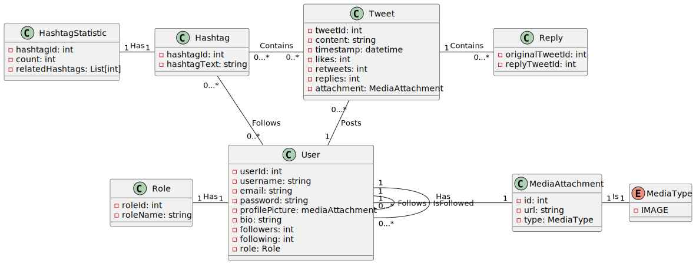

# Phase 1

**Application:** SocialNet

**Description:** a social network similiar to X (formerly Twitter).

- [Phase 1](#phase-1)
  - [Design](#design)
    - [Application Requirements](#application-requirements)
    - [Domain Model](#domain-model)
  - [Technological Decisions](#technological-decisions)
    - [Technological stack](#technological-stack)
    - [Infrastructure](#infrastructure)
  - [Security Analysis](#security-analysis)
    - [Threat Model](#threat-model)

## Design

### Application Requirements

### Domain Model

We are using PlantUML to design our Domain Model, with the first iteration being the following:

We have the following agregates with the following entities:

- Authentication: `Users`, `Roles` and `User-Related Information`
- Tweets: `Tweets` and Tweet `Replies`
- Hashtags: `Hashtags` and `Hashtag Statistics`

The entity `MediaAttachment` is reusable by the various aggregates.

## Technological Decisions

### Technological stack

### Infrastructure

## Security Analysis

### Threat Model

We have modeled our domain and infrastructure on Threat Dragon and the Model is present at the folder [`threat-dragon`](threat-dragon).

The full report, with the security analysis for each infrastructure component, as well as the security analysis for the relationships between our domain entities is present at [`threat-analysis.pdf`](threat-dragon/threat-analysis.pdf).