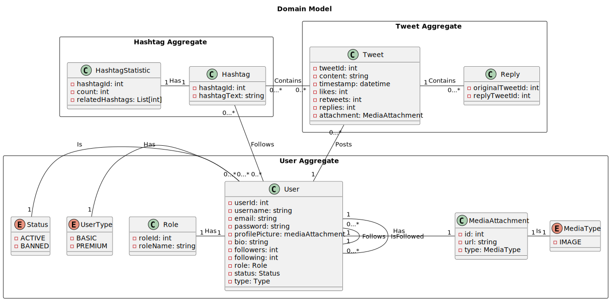
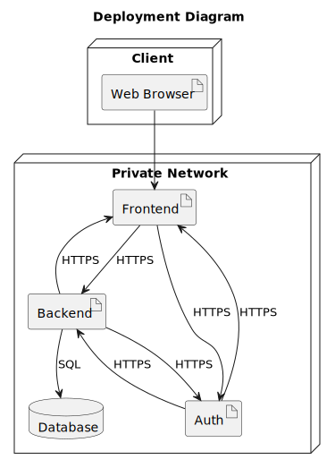

# Phase 1

**Application:** SocialNet

**Description:** a social network similiar to X (formerly Twitter).

- [Phase 1](#phase-1)
  - [Design](#design)
    - [Application Requirements](#application-requirements)
    - [Domain Model](#domain-model)
    - [Use Cases](#use-cases)
      - [Basic User](#basic-user)
      - [Premium User](#premium-user)
      - [Admin User](#admin-user)
      - [Post Interaction](#post-interaction)
      - [Banned Users](#banned-users)
  - [Implementation](#implementation)
  - [Technological Decisions](#technological-decisions)
    - [Tech-Stack](#tech-stack)
    - [Infrastructure - High-Level System Architecture Diagram](#infrastructure---high-level-system-architecture-diagram)
  - [Security Analysis](#security-analysis)
    - [Security Requirements](#security-requirements)
    - [Threat Model](#threat-model)
    - [ASVS Checklist](#asvs-checklist)
  - [Test Plan](#test-plan)

## Design

### Application Requirements

1. A Frontend
2. A Backend
3. A Database
4. An Authentication System (with at least 3 roles)
5. At least 3 aggregates in the domain model
6. Follow the Secure Systems Development Lifecycle (SSDLC) process

Here are the mockups for the frontend application:

The login page serves as the entry point to the frontend application. It features a minimalistic and user-friendly interface, designed to ensure a smooth sign-in process for returning users. Here is an overview of the login page layout and functionality:

- `Header`: At the top of the page, there is a prominent header with the word Login, indicating the purpose of the page.
- `Input Fields`:
  - Username: The first input field is labeled `Username`, where users enter their unique identifier.
  - Password: The second input field is for the `Password`, which is masked for security.
- `Links and Actions`:
  - Forgot Password?: Beneath the password field, there is a link labeled `Forgot Password?` for users who need to reset their credentials.
  - Login Button: Below the password recovery link, there is a `Login button` that users click to submit their credentials and access the application.
- `Registration Prompt`:
  - At the bottom of the login form, there is a prompt `Don't have an account? Register` for new users to navigate to the registration page.

### Domain Model

We are using PlantUML to design our Domain Model, with the first iteration being the following:

We have the following agregates with the following entities:

- Authentication: `Users`, `Roles` and `User-Related Information`
- Tweets: `Tweets` and Tweet `Replies`
- Hashtags: `Hashtags` and `Hashtag Statistics`

The entity `MediaAttachment` is reusable by the various aggregates.

### Use Cases

#### Basic User

The use case diagram provided illustrates the various interactions that a `Basic User` can have within a social media platform, presumably similar to Twitter. At the center of the diagram is the `User` represented by a stick figure icon connected to several actions via lines, indicating different functions or activities that the user can perform on the platform:

1. `Search for Posts`: Indicates the user's ability to search for and find posts published by other users on the platform.
2. `Edit Profile`: The user can modify the information in their personal profile.
3. `Follow Other Users`: This action allows the user to follow other users, which likely means they will see those users' updates in their news feed.
4. `Retweet Posts`: The user can share posts from other users with their own followers, a feature known as retweeting.
5. `Like Posts`: The user can express their enjoyment of a post by clicking a like button.
6. `Comment on Posts`: The user can add comments to posts, allowing for direct interaction with the published content.
7. `Post Tweets`: The user can create and publish their own posts.

#### Premium User

The use case diagram illustrates the extended functionalities available to a `Premium User` within the SocialNet platform. Employing the principle of inheritance, the `Premium User` retains all the capabilities of a `Basic User, with the addition of an exclusive feature:

1. `Access Trends`: Unique to the Premium User, this feature provides access to the platform's trending topics and popular content, offering insights into what is currently engaging the community.

#### Admin User

The use case diagram presented delineates the specific capabilities afforded to an `Admin User` on the SocialNet. Building upon the concept of inheritance, it is clear that the `Admin User` inherits the full spectrum of functionalities of a `Premium User`, with the augmentation of several key administrative powers that are critical for platform management and moderation.

The exclusive administrative features include:

1. `Delete Tweets`: The Admin User has the authority to remove tweets from the platform that may be in violation of the platform's policies or for other administrative reasons.
2. `Ban Users`: This important capability allows the Admin User to restrict access to the platform for users who have breached the terms of service or engaged in prohibited activities.
3. `Access Control Panel`: The Admin User has privileged access to the platform's control panel, which enables them to oversee the platform's operations, modify settings, and perform a wide range of administrative tasks.

Abuse cases identified:
 
1. Posting a tweet that is longer than allowed
2. Trying to upload attachments that are bigger than allowed
3. Tring to like too many posts in a given period of time
4. Trying to follow too many users in a given period of time
5. Commenting on a post with more caracters than allowed
6. Performing searchs with SQL instructions or system paths
7. Posting Hashtags with SQL instructions or system paths

#### Post Interaction

The use case diagram provided focuses on `Post Interaction` within the SocialNet platform, delineating the actions that are available to users when interacting with posts. The diagram specifies two roles involved in this interaction: the `Author` of the post and the `Follower` who engages with the post.

For the `Author`, the capabilities highlighted are:

1. `Post`: The Author can create and publish a post, sharing their thoughts, announcements, or information with their followers.
2. `Attach Image to the post`: An extension of posting, this function allows the Author to enhance their message by adding visual content, such as images, which can make the post more engaging and informative.

For the `Follower`, the diagram outlines two distinct actions:

1. `Retweet`: Followers can redistribute the Author's post to their own followers, thereby amplifying its reach and visibility on the platform.
2. `Like a Post`: Followers can show their appreciation or agreement with the Author's tweet by liking it, a simple interaction that also serves as feedback to the Author.

Abuse cases identified:

1. Posting too many tweets in a given period of time

#### Banned Users

The use case diagram for `Banned Users` outlines the process that occurs when a user who has been banned from the social networking platform, SocialNet, attempts to access their account. The procedure is as follows:

1. `Attempt Login`: The User begins the process by attempting to log in to the SocialNet system.
2. `SocialNet System`: The system receives the login attempt and initiates a verification sequence.
3. `Verify Ban Status`: As part of the login sequence, the system checks the user's account against a list of banned users.
4. `Redirect to Ban Page`: If the user is found to be banned, instead of completing the login process, the system redirects the user to a Ban Page. This page presumably informs the user of their ban status and may include details about the reason for the ban, and potentially how to appeal the decision if that option is available.

Abuse cases identified:

1. Accessing the website too many times in a given period of time

## Implementation

Port description:

- `HTTPS`: port `443`
- `SQL`: port `5432` (Postgres)

## Technological Decisions

### Tech-Stack

- [Docker](https://docker.com) as the containerization and deployment technology
- [Python3 (3.12)](https://www.python.org/downloads/release/python-3120/) for the Backend
- [ReactJS](https://react.dev/) for the Frontend
- [Supabase](https://supabase.com/docs) (with the [Python Client](https://supabase.com/docs/reference/python/start)) for Authentication and Authorization
- [Cloudflare Tunnels](https://developers.cloudflare.com/cloudflare-one/connections/connect-networks/) to expose the application (custom domain to be defined)
- [Postgres](https://www.postgresql.org/) as the database engine

### Infrastructure - High-Level System Architecture Diagram

## Security Analysis

### Security Requirements

- Authentication
  - Multi-Factor Authentication: email or OTP codes using an authenticator
  - Least privilege: users will not be authorized to perform any actions they are not supposed
  - Addition Principle: roles will have incremental permissions
- HTTPS between users and frontend
- HTTPS between containers whenever possible (might not be possible due to endpoints not being exposed)
- Hashed and Salted passwords (provided by supabase)
- Private network within Docker: no exposed ports
- Design the RBAC using an Allowlist pattern: `A list of who or what that is allowed access to a given device, service, or other`

Data that we consider sensitive within our domain model:

- User passwords
- User emails

### Threat Model

This is the Risk Matrix used to classify the threats:

We have modeled our domain and infrastructure on Threat Dragon and the Model is present at the folder [`threat-dragon`](threat-dragon).

The approach we took: analyze the [Data Flow Diagram](#implementation) and apply the [STRIDE model](https://learn.microsoft.com/en-us/azure/security/develop/threat-modeling-tool-threats#stride-model) to each component, trying to identify the threats and elaborate mitigations. After the classification according to the matrix we analyze if the threat is already mitigated by design choices or if further intervention is needed (in the coming phases).

The full report, with the security analysis for each infrastructure component, as well as the security analysis for the relationships between our domain entities is present at [`threat-analysis.pdf`](threat-dragon/threat-analysis.pdf).

Please refer to the section  for the tests we consider necessary at this stage upon implementation.

### ASVS Checklist

Here are the results for the ASVS Checklist for this iteration.

Please note that this is an ongoing process and certain entries marked as `Not Applicable` will be handled in Phase 2.

Full checklist available at [`asvs`](asvs).

## Test Plan

In this section we will be describing all tests that we define as needed to test the mitigations that are identified during the [threat modeling process](#threat-model).

- Client:
  - Verify that the client can access the frontend securely over HTTPS and HTTP is redirected to HTTPS
  - Test for session management: verify that session tokens are securely generated, transmitted, and invalidated upon logout and stored properly (e.g encripted cookies)
  - Test for input validation: ensure that user inputs are properly validated to prevent injection attacks (for instance validate `WHERE`, `DROP` and `SELECT` statements)
- Frontend:
  - Verify that authentication mechanisms are correctly implemented and prevent unauthorized access (verify that MFA is working and mandatory)
  - Test for access control: ensure that users can only access resources they are authorized to (RBAC) to prevent escalation of privilege (test for the Allowlist pattern)
  - Perform cross-site scripting (XSS) to verify the impact that the frontend has on other components
- Backend:
  - Verify that backend APIs are securely accessible over HTTPS only, with HTTP being redirected to HTTPS
  - Test for input validation and parameterized queries to prevent SQL injection attacks (for instance validate `WHERE`, `DROP` and `SELECT` statements and not trust on the frontend validations)
  - Test for proper error handling and logging of security-related events by verifying if sensitive information is logged on an error (should not be)
  - Perform authentication bypass testing to ensure authorization is always required and test for escalation of privilege
- Authentication System:
  - Verify that user authentication works correctly with valid credentials and invalid credentials as well
  - Test for authentication weaknesses such as brute force attacks
  - Perform session management testing to ensure session tokens are securely handled and invalidated after a certain period of time
  - Test for account lockout mechanisms and password complexity requirements in order to mitigate brute-force attacks
- Database:
  - Verify that the database is securely configured to only allow access from authorized users and has the permissions segregated (routes to list should use users with read-only access)
  - Test for proper data encryption at rest of sensitive data and user data, so that SQL injection attacks are mitigated
  - Perform SQL injection testing to ensure that input sanitization is implemented correctly (supabase provides this with parameterized queries out-of-the-box)
  - Test if database backups are running properly (on a selected cron, to be defined upon implementation)