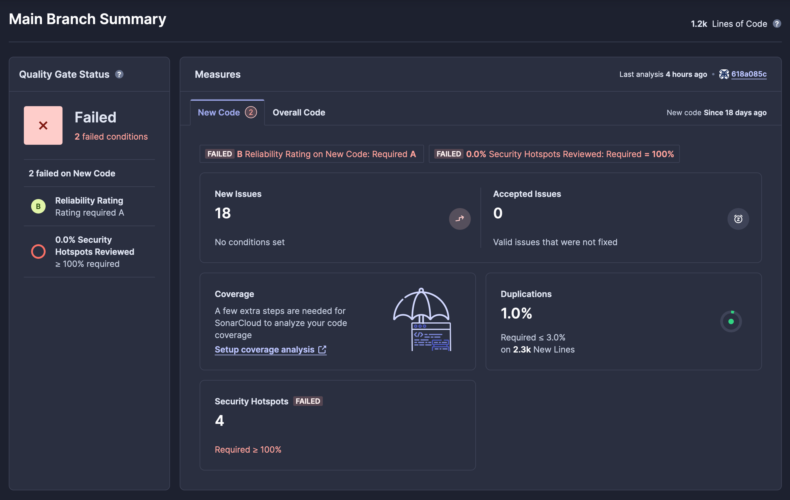
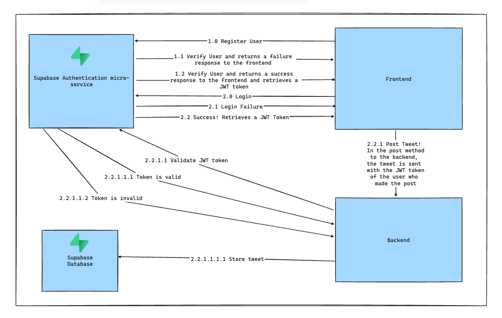

# Phase 2 - Sprint 1

## Table of Contents

- [Phase 2 - Sprint 1](#phase-2---sprint-1)
  - [Table of Contents](#table-of-contents)
  - [Objective](#objective)
  - [Pipeline Design](#pipeline-design)
    - [Frontend](#frontend)
    - [Backend](#backend)
  - [Aplication Development](#aplication-development)
    - [Authorization Architecture](#authorization-architecture)
    - [Frontend](#frontend-1)
    - [Backend](#backend-1)
  - [Tests](#tests)
  - [Deployment](#deployment)
  - [Future Work/Improvements](#future-workimprovements)
    - [Secrets Management](#secrets-management)
    - [MVC - Model View Controller (Backend)](#mvc---model-view-controller-backend)
    - [Logging system](#logging-system)
  - [ASVS Results](#asvs-results)

## Objective

In this sprint we were expected to develop some code for our application and build the pipeline that will build and maintain our code.

<!---->

## Pipeline Design

The pipeline will consist of the following steps:

1. Build
2. Test
3. Perform Static Analysis
4. Package
5. Deploy

The pipeline is built on top of GitHub Actions and our files are present at the [`.github`](../../../.github/workflows/).

The static analysis will be provided by [Sonarcloud](https://www.sonarsource.com/products/sonarcloud/), a free tool that perform analysis on our code and delivers detailed results regarding security and improvements to be made:




Our pipeline will be triggered upon a Pull Request and will dinamically verify what path is being changed in order to run the workflow related to that path:

```YAML
# BACKEND
on:
  pull_request:
    branches: [main]
    paths:
      - backend/**

# FRONTEND
on:
  pull_request:
    branches: [ main ]
    paths:
      - frontend/**
```

We are also using Dependabot, a free tool that analyzes packages inside multiple files for various programming languages and opens Pull Requests with suggestions regarding updates for both out-of-date tools and tools that are under security compromises [`dependabot.yaml`](../../../.github/dependabot.yml):

```YAML
version: 2
updates:
  # Will analyze the frontend folder for packages
  - package-ecosystem: "npm"
    directory: "./frontend"
    schedule:
      interval: "weekly"

  # Will analyze the backend folder for packages
  - package-ecosystem: "pip"
    directory: "./backend"
    schedule:
      interval: "weekly"
# Both produce an weekly report
```

There are the pull requests generated by dependabot:


These follow [Semantc Versioning](https://semver.org/) and [Conventional Commits](https://www.conventionalcommits.org/en/v1.0.0/), which we have adopted and are enforcing on our development process.

### Frontend

Regarding the frontend, we have built the following [steps](../../../.github/workflows/frontend.yaml):

1. Checkout Code
2. Set up Node.js 20.9.0
3. Install the [`npm`](../../../frontend/package.json) dependencies
4. Build the project
5. SonarCloud scan

In this iteration, we did not implement tests on the frontend side, but in the next iteration, our goal is to use the Jest tool to implement coverage for the frontend code. After executing the tests, a report will be generated in the pull request, just as we did on the backend.

### Backend

Regarding the backend, we have built the following [steps](../../../.github/workflows/backend.yaml):

1. Checkout the code
2. Set up Python 3.11 (initially we wanted 3.12 but is not suported on ARM64 machines yet)
3. Install the `poetry` package and `toml` packages
4. Install the [`pyproject.toml`](../../../backend/pyproject.toml) dependencies
5. Perform the tests using `pytest` and generate the coverage report
6. Post the coverage report to the PR that is associated with the pipeline
7. Build the docker image using the [`pyproject.toml`](../../../backend/pyproject.toml) version
8. Tag the docker image accordingly
9. Update the Backend Container that is running in our VM (more info at the [Deployment](#deployment) section)

Since Python is an interpreted language, we do not need to run any compilers.

The code coverage report is generated like so:


In case the tests fail nothing else proceeds.

<!---->

## Aplication Development

### Authorization Architecture



This diagram represents the architecture of our application. If the user wants to register on SocialNet, a request is made to the Supabase Authentication service, which validates and returns a success or error response to the frontend. If the user wants to log in to SocialNet, a request is made to the Supabase Authentication service, which validates and returns a success or error response to the frontend. In both cases (registration and login), if the response from the micro-service to the frontend is successful, a JWT token is returned.

When a user interacts with a tweet, a POST method is sent with the JWT token of the user who made the post. The backend receives this post and validates against the Supabase micro-service to check if the user's JWT token is valid and exists. If valid, the tweet is stored in the Supabase database.

### Frontend

On the frontend, during this iteration, we developed the authentication system, a password recovery system, and session management.

The [login page](../../../frontend/src/app/login/page.tsx) allows users to log in with their email and password using the Supabase authentication service. The page also includes functionality for users to reset their password if they've forgotten it. The interface adjusts dynamically to switch between login and password reset modes based on user interaction. Error messages are displayed if the login or password reset attempts fail.

If the user wants to reset their password, they will receive an email with a temporary link. By clicking on this link, they will be redirected to the reset page.
The [reset page](../../../frontend/src/app/reset/page.tsx) allows users to enter a new password and confirm it to reset their password. The page includes an option to show or hide the password input for better user experience. Once the passwords match and are confirmed, the new password is updated using the Supabase authentication service, and the user is redirected to the home page. If the passwords do not match, an alert notifies the user.

It was also created a [middleware](../../../frontend/src/middleware.ts) to manage user authentication using Supabase. The middleware checks if a user is logged in before allowing access to most pages. Certain URLs, like `/reset`, are publicly accessible without authentication. If the user is not authenticated and tries to access a protected page, they are redirected to the login page. This ensures that only authenticated users can access specific parts of the application.

### Backend

We have secured all the routes with authentication, using a functionality of FastAPI called Dependencies. This means that [every route](../../../backend/src/backend/main.py#L29) will require authentication that is present at [`auth.py`](../../../backend/src/backend/application/auth.py).

This authentication method first decodes the token with our private key (more info at the [Improvements section](#secrets-management)) and then validates if the session is valid and the user exists, using [Supabase Python Client](https://supabase.com/docs/reference/python/introduction) and the flow described at the [Authorization Architecture](#authorization-architecture).

These are the currently available routes:


If the authorization fails, we receive an `HTTP 403` status code and one of the following errors:

```json
// No auth
{
  "detail": "Not authenticated"
}
// Wrong auth
{
  "detail": "Invalid token or expired token."
}
```

This is an example of a successful GET request for Tweets:

```json
[
  {
    "content": "stringstringstringstringstringstringstringstringstringstringstringstringstringstringstringstringstringstringstringstringstringstringstringstringstringstringstringstringstringstringstringstringstringstringstringstringstringstringstringstringstringstringstringstringstringstringstri",
    "id": 2,
    "created_at": "2024-05-15T18:47:42.148199Z"
  },
  {
    "content": "stringstringstringstringstringstringstringstringstringstringstringstringstringstringstringstringstringstringstringstringstringstringstringstringstringstringstringstringstringstringstringstringstringstringstringstringstringstringstringstringstringstringstringstringstringstringstri",
    "id": 5,
    "created_at": "2024-05-15T18:54:00.319477Z"
  }
]
```

Please be aware that these are simply test data, for testing purposes.

<!---->

## Tests

According to Phase 1, we have elaborated a list of tests to be made to test for vulnerabilities ([phase 1 test list](../../phase_1/README.MD#test-plan)).

Taking this in consideration we have performed tests for the routes, validating the authentication, the requirements for tweets (minimum size of 280 characters and maximum of 2400, enforced by Pydantic's model: [`tweet.py`](../../../backend/src/backend/domain/tweet.py#L12-L18)) and these are present on the file [`test.py`](../../../backend/tests/test_routes.py).

Running them provides a report and the coverage associated with the tests performed, as stated in the section [Pipeline Design - Backend](#backend).

<!---->

## Deployment

For our deployment, we are running a Virtual Machine to simulate a server in which we deployed:

- A backend stack, with a Redis Server, a Cloudflared Service and the Backend API container
- A Supabase self-hosted stack with our database and PostgREST API to access that database

We have a simple docker-compose that allows us to pass a variable with the version of the image being deployed and this allows the pipeline to update [the docker-compose stack](../../../.github/workflows/backend.yaml#L58-L65):

```YAML
services:
  cloudflared:
    restart: always
    container_name: cloudflared
    image: cloudflare/cloudflared:latest
    command: tunnel --no-autoupdate run --token <token>
    extra_hosts:
      - "host.docker.internal:host-gateway"

  redis:
    container_name: redis
    restart: always
    image: redis:alpine
    ports:
      - 6379:6379
    networks:
      - socialnet

networks:
  socialnet:
    name: socialnet
    driver: bridge
---
services:
  backend:
    container_name: backend
    restart: always
    image: socialnet-backend:${VERSION:-latest}
    ports:
      - 5000:5000
    networks:
      - socialnet
    environment:
      - REDIS_HOST=redis
```

Cloudflared allows us to expose the API to the internet without the need for a reverse proxy. All TLS communication is handled by Cloudflare and more information on how Cloudflare Tunnels work [is available here](https://www.cloudflare.com/products/tunnel/).

Finally, our runner is installed using the documentation [provided by GitHub](https://docs.github.com/en/actions/hosting-your-own-runners/managing-self-hosted-runners/adding-self-hosted-runners) and has access to these services and can manage them. The information travels between GitHub and the Runner encrypted, as per GitHub's design.

The [Supabase Self-Hosted](https://supabase.com/docs/guides/self-hosting) Docker Compose stack is available at [`supabase/docker`](../../../supabase/docker/).

Using a Virtual Machine is **purely** for academic purposes and to avoid unnecessary costs. The idea is to simulate a remote server and we are currently using [UTM](https://github.com/utmapp/UTM), a free and Open Source virtualization tool.

<!---->

## Future Work/Improvements

### Secrets Management

We have some development secrets in a `dotenv` file present in the repository, this will be cleaned up in the sprint 2.

We will be enforcing more of GitHub Secrets for the repository, which we currently do for test users [`backend.yaml`](../../../.github/workflows/backend.yaml#L42-L45).

### MVC - Model View Controller (Backend)

We will have to refactor the [`main.py`](../../../backend/src/backend/main.py) file in the backend to adopt a Model -> View -> Controller architecture, with a properly defined layer of service and controller to handle exceptions and remove the business logic from the View Layer which has the HTTP routes.

### Logging system

One of the future improvements we plan to implement is a comprehensive logging system. This system will capture and store detailed logs of user activities, application events, and error occurrences. By integrating a logging mechanism, we aim to enhance the application's observability, making it easier to monitor performance, troubleshoot issues, and maintain security. This will also enable us to generate valuable insights and analytics, ultimately leading to a more reliable and user-friendly application.

## ASVS Results

The ASVS Results are the following (full Excel file available at [`asvs`](asvs/)):


