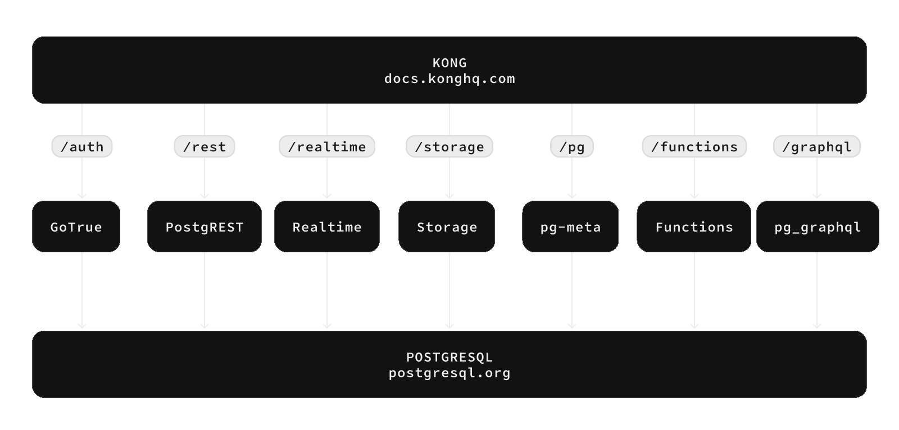
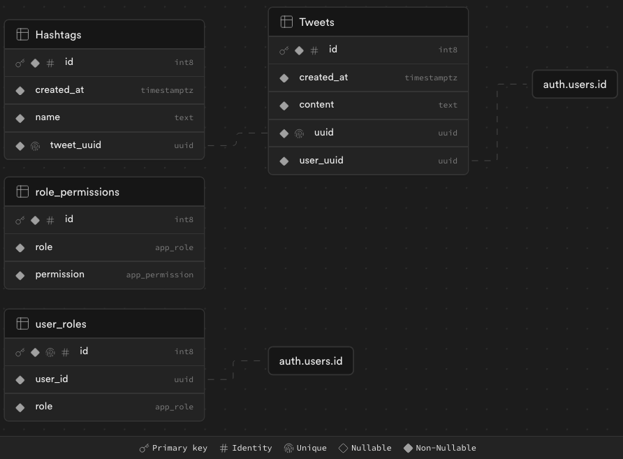
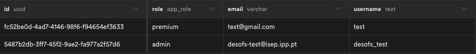
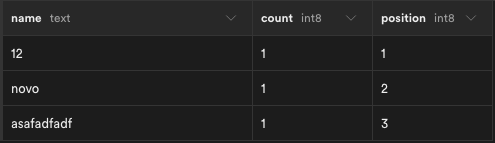

# Phase 2 - Sprint 2

- [Phase 2 - Sprint 2](#phase-2---sprint-2)
  - [Objective](#objective)
  - [Supabase](#supabase)
    - [Database](#database)
      - [Users](#users)
      - [Trends](#trends)
      - [Tweets and Hashtags](#tweets-and-hashtags)
        - [Tweets](#tweets)
        - [Hashtags](#hashtags)
      - [RBAC](#rbac)
    - [Storage](#storage)
  - [Backend](#backend)
    - [Domain](#domain)
    - [Configurations](#configurations)
    - [MVC](#mvc)
      - [API](#api)
      - [Services](#services)
      - [Repositories](#repositories)
    - [Authentication \& RBAC](#authentication--rbac)
    - [Logging and Error Handling](#logging-and-error-handling)
    - [Security](#security)
      - [Single-Read Objects](#single-read-objects)
      - [Private Attributes](#private-attributes)
      - [Others](#others)
    - [Pipeline](#pipeline)
  - [Frontend](#frontend)
    - [Frontend Goal](#frontend-goal)
    - [Supabase initialization](#supabase-initialization)
    - [Frontend Middleware](#frontend-middleware)
    - [API Calls](#api-calls)
      - [Fetching Tweets](#fetching-tweets)
      - [Fetching Tweets by User](#fetching-tweets-by-user)
      - [Posting a Tweet](#posting-a-tweet)
      - [Deleting a Tweet](#deleting-a-tweet)
      - [Fetching User Information](#fetching-user-information)
      - [Fetching Multiple Users](#fetching-multiple-users)
      - [Fetching Profile Picture](#fetching-profile-picture)
      - [Posting Profile Picture](#posting-profile-picture)
      - [Fetching Trends](#fetching-trends)
    - [Atomic Design System](#atomic-design-system)
      - [Key Concepts](#key-concepts)
      - [Benefits of Using Atomic Design](#benefits-of-using-atomic-design)
      - [Implementation in SocialNet](#implementation-in-socialnet)      
    - [Views](#views)
      - [Login View](#login-view)
        - [Key Features](#key-features)
        - [Code Overview](#code-overview)
      - [Reset Password View](#reset-password-view)
        - [Key Features](#key-features-1)
        - [How It Works](#how-it-works)
        - [User Flow](#user-flow)
      - [Homepage View](#homepage-view)
        - [Key Features](#key-features-2)
        - [How It Works](#how-it-works-1)
        - [User Flow](#user-flow-1)
      - [Profile View](#profile-view)
        - [Key Features](#key-features-3)
        - [How It Works](#how-it-works-2)
        - [User Flow](#user-flow-2)
      - [Trends View (Premium/Admin Users - only)](#trends-view-premiumadmin-users---only)
        - [Key Features](#key-features-4)
        - [How It Works](#how-it-works-3)
        - [User Flow](#user-flow-3)
      - [Admin View (Admin Users - only)](#admin-view-admin-users---only)
        - [Key Features](#key-features-5)
        - [How It Works](#how-it-works-4)
        - [User Flow](#user-flow-4)
    - [Components](#components)
      - [Feed Component](#feed-component)
        - [Key Features](#key-features-6)
        - [How It Works](#how-it-works-5)
      - [Sidebar Component](#sidebar-component)
        - [Key Features](#key-features-7)
        - [How It Works](#how-it-works-6)
        - [User Flow](#user-flow-5)
      - [SidebarRow Component](#sidebarrow-component)
        - [Key Features](#key-features-8)
        - [How It Works](#how-it-works-7)
        - [Code Overview](#code-overview-1)
        - [Usage](#usage)
      - [TrendTable Component](#trendtable-component)
        - [Key Features](#key-features-9)
        - [How It Works](#how-it-works-8)
        - [Usage](#usage-1)
      - [Tweet Component](#tweet-component)
        - [Key Features](#key-features-10)
        - [How It Works](#how-it-works-9)
        - [User Flow](#user-flow-6)
      - [TweetBox Component](#tweetbox-component)
        - [Key Features](#key-features-11)
        - [How It Works](#how-it-works-10)
        - [User Flow](#user-flow-7)
      - [UserInfo Component](#userinfo-component)
        - [Key Features](#key-features-12)
        - [How It Works](#how-it-works-11)
        - [User Flow](#user-flow-8)
      - [Widgets Component](#widgets-component)
        - [Key Features](#key-features-13)
        - [How It Works](#how-it-works-12)
        - [User Flow](#user-flow-9)
    - [Error Handling](#error-handling)
      - [Key Features](#key-features-14)
      - [How It Works](#how-it-works-13)


## Objective

In this sprint we were expected to develop the rest of the application, following the best practices possible and implementing/enhancing the pipeline and/or tests.

## Supabase

Supabase provided us with the Database, Authentication and Storage systems needed to make our backend application. Our database is hosted on AWS, in Europe and is fully accessible as any other database would be, but higly discouraged since Supabase provides all the means to safely manage the database without risk of data corruption.



Supabase uses Kong as the webserver for the multiple paths and, specifically for the database, it implements a REST ([PostgREST](https://postgrest.org/en/v12/)) interface on top of Postgres that allows multiple operations such as Authentication and Authorization.

### Database

Under the hood, it uses [Row Level Security](https://supabase.com/docs/guides/database/postgres/row-level-security) rules, following the official [Row Security Policies](https://www.postgresql.org/docs/current/ddl-rowsecurity.html) Postgres Implementation and, for us, this means that we can implement our RBAC in the Backend and at the Database level. When a RLS rule is created, prior to an UPDATE, INSERT, DELETE or any operation these policies are validated against the user that is trying to perform the action; if the rule fails than the action is not carried on (for instance `default` users cannot delete tweets so they cannot perform a `DELETE FROM socialnet."Tweets"` operation).

Supabase also allows custom [Custom Claims & Role-based Access Control (RBAC)](https://supabase.com/docs/guides/database/postgres/custom-claims-and-role-based-access-control-rbac?queryGroups=language&language=plpgsql) by implementing a set of rules and Postgres policies and these are reflected in the generated [JWT token](https://supabase.com/docs/guides/auth/jwts), so we can control operations in the backend by validating this token.

We ended up creating the following tables on the `socialnet` schema in our database:



In this database schema there are references to the table `auth.user.id`, which is a managed table by Supabase and has information regarding the users that are registered onto the project, such as if they have OTP enabled, MFA, if they are verified, their Unique ID, etc. We reference that table for our operations but cannot change the table itself.

#### Users

To fetch user information we ended up creating a [View](https://www.postgresql.org/docs/current/sql-createview.html), which queries information from multiple tables and allows users to query this view as if it was a table. From a security point-of-view this is better than managing a new table because these queries are ran by Postgres and do not accept user inputs, so information cannot be changed while querying a view.

```sql
CREATE OR REPLACE VIEW
  socialnet."users" AS
SELECT
  u.id,
  u.email,
  ur.role,
  LOWER(
    regexp_replace(
      TRIM(SPLIT_PART(u.email, '@', 1)),
      '[^a-zA-Z0-9]',
      '_',
      'g'
    )
  ) AS username
FROM
  auth.users AS u
  INNER JOIN socialnet.user_roles AS ur ON u.id = ur.user_id;
```



This view feeds our backend with information regarding the users that we can then return to the frontend and references the original `auth.users` table without changing any information.

#### Trends

For the Trends functionality we have created another view that is dynamic, showing us the top-10 Hashtags from the last 24 hours.

```sql
DROP VIEW IF EXISTS socialnet.trends;
CREATE VIEW socialnet.trends AS
SELECT
    name,
    COUNT(*) AS count,
    ROW_NUMBER() OVER (ORDER BY COUNT(*) DESC) AS position
FROM     socialnet."Hashtags"
WHERE    created_at >= Now() - interval '1 DAYS'
group BY name
ORDER BY count DESC limit 10;
```



#### Tweets and Hashtags

##### Tweets

```sql
create table
  socialnet."Tweets" (
    id bigint generated by default,
    created_at timestamp with time zone not null default now(),
    content text not null,
    uuid uuid not null default gen_random_uuid () as identity,
    user_uuid uuid not null default auth.uid (),
    constraint Tweets_pkey primary key (id),
    constraint Tweets_uuid_key unique (uuid),
    constraint Tweets_user_uuid_fkey foreign key (user_uuid) references auth.users (id) on update cascade on delete cascade
  ) tablespace pg_default;
```

Our Tweets are **not** identified by an incremental `id` but by an [UUID](https://en.wikipedia.org/wiki/Universally_unique_identifier) that is generated whenever a Tweet is posted and provides an extra security against SQL injection attacks, since it would be near impossible to randomly guess an UUID since these values depend on the Operating System that is generating them, the time, the content, etc.

To these table we applied the following RLS policies:

```sql
create policy "Allow tweet post" on socialnet."Tweets" for insert to authenticated
with
  check (
    (
      select
        auth.uid ()
    ) = user_id
  );
create policy "Allow authorized delete" on socialnet."Tweets" for delete using (
  (
    SELECT
      socialnet.authorize ('tweet.delete')
  )
);
```

Any authenticated (default PostgREST role for authenticated users and, in our case, corresponds to the `default` user)  user can post a Tweet since it is a basic functionallity of the Socialnet Application, but only users that have the `tweet.delete` permission can perform a DELETE operation (more information on [RBAC](#rbac)).

##### Hashtags

The hashtags are identified by an incremental ID because they are associated with a tweet and there is the Foreign Key constraint that prevents a single delete of an Hashtag while the referenced Tweet still exists and they simply contain a name.

```sql
create table
  socialnet."Hashtags" (
    id bigint generated by default as identity,
    created_at timestamp with time zone not null default now(),
    name text not null,
    tweet_uuid uuid not null,
    constraint Hashtags_pkey primary key (id),
    constraint Hashtags_tweet_uuid_key unique (tweet_uuid),
    constraint Hashtags_tweet_uuid_fkey foreign key (tweet_uuid) references socialnet."Tweets" (uuid) on update cascade on delete cascade
  ) tablespace pg_default;
```

We created the following RLS policies:

```sql
create policy "Allow authorized delete" on socialnet."Hashtags" for delete using (
  (
    SELECT
      socialnet.authorize ('hashtag.delete')
  )
);
```

Following the Tweets logic, only users with the `hashtag.delete` permission can perform a `DELETE` operation on this table.

#### RBAC

For the RBAC at the Database/Authentication level we created a series of configurations that allows us to *inject* a new field on the JWT token associated with each user session and that we can then use in the Backend or Frontend. With these configurations we also created RLS policies that define what users can and cannot do on the database given their roles.

```sql
-- Provide authorization for the PostgREST API user that handles the authentication of users
grant usage on schema socialnet to supabase_auth_admin;

-- Block Authenticated and Anonymous users to perform operations on the socialnet."user_roles" table
revoke all on table socialnet."user_roles"
from
  authenticated,
  anon;

-- Allow PostgREST authentication user to query the socialnet."user_roles" table to handle user authentication
create policy "Allow auth admin to read user roles" ON socialnet."user_roles" as permissive for
SELECT to supabase_auth_admin using (true);

-- Create the ENUM type with the possible Permissions for the application
create type socialnet."app_permission" as enum('tweet.delete', 'trends.view', 'hashtag.delete');

-- Create the Application Roles
create type socialnet.app_role as enum('default', 'premium', 'admin');

-- Create the socialnet."user_roles" table that associates <user_uuid>-<app_role>
create table
  socialnet."user_roles" (
    id bigint generated by default as identity primary key,
    user_id uuid references auth.users on delete cascade not null,
    role socialnet.app_role not null,
    unique (user_id, role)
);

comment on table socialnet."user_roles" is 'Application Role';

-- Creates the socialnet."role_permissions" that associates <role>-<app_permission>
create table
  socialnet."role_permissions" (
    id bigint generated by default as identity primary key,
    role socialnet.app_role not null,
    permission socialnet.app_permission not null,
    unique (role, permission)
);

comment on table socialnet.role_permissions is 'Application Permission';

-- Create the auth hook function that modifies the JWT token with the custom role field
create
or replace function socialnet."custom_access_token_hook" (event jsonb) returns jsonb language plpgsql stable as $$
  declare
    claims jsonb;
    user_role socialnet.app_role;
  begin
    -- Check if the user is marked as admin in the profiles table
    select role into user_role from socialnet."user_roles" where user_id = (event->>'user_id')::uuid;

    claims := event->'claims';

    if user_role is not null then
      -- Set the claim
      claims := jsonb_set(claims, '{user_role}', to_jsonb(user_role));
    else
      claims := jsonb_set(claims, '{user_role}', 'default');
    end if;

    -- Update the 'claims' object in the original event
    event := jsonb_set(event, '{claims}', claims);

    -- Return the modified or original event
    return event;
  end;
$$;

-- Create the function that authorizes actions based on the association of <role>-<app_permission>
create
or replace function socialnet."authorize" (requested_permission socialnet.app_permission) returns boolean as $$
declare
  bind_permissions int;
  user_role socialnet.app_role;
begin
  select (auth.jwt() ->> 'user_role')::socialnet.app_role into user_role;

  select count(*)
  into bind_permissions
  from socialnet."role_permissions"
  where role_permissions.permission = requested_permission
    and role_permissions.role = user_role;

  return bind_permissions > 0;
end;
$$ language plpgsql stable security definer
set
  search_path = '';

-- Views do not have RLS but the queries underneath must respect RLS so we enable security_invoker for that effect
-- Enable security_invoker for the Trends view
ALTER VIEW socialnet."trends"
SET
  (security_invoker = on);

-- Enable security_invoker for the Users view
ALTER VIEW socialnet."users"
SET
  (security_invoker = on);
```

Whenever a new user is created it receives the role `default` so we also enabled this behaviour using a function that runs after a new user is created:

```sql
-- Create a public function that can be run whenever we need
create or replace function public.handle_new_user () returns trigger as $$ begin
    insert into socialnet."users" (id, aud, email)
    values (new.id, new.aud, new.email);
    insert into socialnet.user_roles (user_id, role)
    values (new.id, 'default');
    return new;
end;
$$ language plpgsql security definer;

-- Create a trigger that runs the function public.handle_new_user() after a new user is inserted on the auth.users table
create trigger on_auth_user_created
after insert on auth.users for each row execute procedure public.handle_new_user();
```

In order to allow administrators to change the roles of other users we enabled the following:

```sql
-- Authenticated users can view their own role
CREATE POLICY "Users can view their own role" ON socialnet."user_roles" FOR
SELECT TO authenticated USING (true);

-- This function will return a boolean by querying the socialnet.user_roles table and verifying if the authenticated user is an admin
CREATE OR REPLACE FUNCTION socialnet.is_current_user_admin() RETURNS boolean AS $$
BEGIN
    RETURN EXISTS (
        SELECT 1
        FROM socialnet.user_roles ur
        WHERE ur.user_id = (select auth.uid())
        AND ur.role = 'admin'
    );
END;
$$ LANGUAGE plpgsql;

-- If the user is an Admin they can alter the roles of other users (UPDATE the table socialnet."user_roles")
CREATE POLICY update_role_policy ON socialnet."user_roles"
FOR UPDATE
USING (socialnet.is_current_user_admin())
```

With this we concluded the configuration of the Database, as well as RBAC policies and security configurations we want to enable. All has been done manually, so Supabase only provided a user-friendly UI to manage the database, but we also have instructions to perform the same Database connection using [PGAdmin](../../../backend/README.md#pgadmin) (would also work with standard tools like `psql`).

### Storage

Supabase provides us with an [S3-compatible object storage service](https://supabase.com/docs/guides/getting-started/architecture#storage-api-large-file-storage) that we use to host our profile pictures and tweet images. Database policies also apply here since each object has it's own corresponding row in the `auth.storage` table and, by using a REST API with authorization, Supabase is capable of validating if whoever is requesting an object is allowed to perform that request, which introduces another extra level of security for data-at-rest (by also using RLS policies).

We created the following RLS policies for the storage table:

```sql
CREATE POLICY "Users can Upload Profile Pictures 1mkux3k_0" ON storage.objects FOR
SELECT TO authenticated USING (bucket_id = 'socialnet');
CREATE POLICY "Users can Upload Profile Pictures 1mkux3k_1" ON storage.objects FOR
INSERT TO authenticated WITH CHECK (bucket_id = 'socialnet');
```

In the Backend we are using Docker Containers to deploy the backend with no exposed Docker Volumes, so the storage is volatile. This is not a problem because the images are stored in Supabase and this also increases security as the Host OS is not accessible in case of an attack.

We are also using Temporary Files within Python, [`Named Temporary Files`](https://docs.python.org/3/library/tempfile.html) that are not persisted and live inside the `/tmp` directory of the Container and are deleted whenever there is a restart or a re-deploy or the file is no longer accessed by a Python function:

```python
with NamedTemporaryFile(
            delete=True,
        ) as tmp_image:
            try:
                self.__client.auth.set_session(
                    access_token=request.state.jwt, refresh_token=""
                )
                path = f"tweets/{uuid}"
                contents = image.file.read()
                tmp_image.write(contents)
```

## Backend

We have fully developed our backend using Python 3.11.

We used Pydantic for data and model validation, FastAPI to serve our endpoints and the Supabase Python Client to access our Supabase Project.

### Domain

We created the [domain classes](../../../backend/src/backend/domain/) for:

- Hashtags
- Tweets
- Users

We have implemented Data Transfer Objects that can be used to return information from the database. The base models implemented serve as the input for the FastAPI application and perform validation of the input data, using the [Annotated Types such as constrained strings](https://docs.pydantic.dev/latest/concepts/types/).

```python
class Tweet(BaseModel):
    content: Annotated[
        str,
        StringConstraints(
            min_length=settings.tweet_min_size,
            max_length=settings.tweet_max_size,
        ),
    ]

    @computed_field
    @property
    def hashtags(self) -> List[Hashtag]:
        return TypeAdapter(List[Hashtag]).validate_python(
            [{"name": h} for h in re.findall(r"#(\w+)", self.content)]
        )


class TweetDto(Tweet):
    id: int
    created_at: datetime
    uuid: UUID
    user_uuid: UUID
```

Pydantic allows to create `compute_field` properties on the classes which allow to fetch information after the object is created, without the need to modify it.

### Configurations

We implemented a [settings class](../../../backend/src/backend/infrastructure/config.py) that validates the data from a Dotenv file and parses it, returning a class with the attributes filled by the variables present in that dotenv file.

```python
class Settings(BaseSettings):
    model_config = SettingsConfigDict(
        env_file=".env", env_file_encoding="utf-8", extra="allow"
    )
    tweet_min_size: int
    tweet_max_size: int
    supabase_url: str
    supabase_key: str
    jwt_secret_key: str
    jwt_algorithms: List[str]
    jwt_audience: List[str]
    redis_host: str
    redis_port: int
    redis_password: str
    cors_origins: List[str]
```

Comparing to the [first sprint](../sprint_1/) we have improved our secret management by not commiting to the GitHub repository the dotenv file and by using this class, so no more `os.environ.get()` calls are made, which reduces risk of forgetness of variables hard-coded. This class is used in all the code to fetch settings global to all the Backend.

### MVC

#### API

The [`main.py`](../../../backend/src/backend/main.py) file includes the declaration of the FastAPI `app`:

```python
app = FastAPI(
    title="SocialNet - Backend",
    description="The Backend for the SocialNet application",
    dependencies=[Depends(JWTBearer()), Depends(RateLimiter(times=20, seconds=5))],
    lifespan=lifespan,
)
```

After that, we have added a CORS middleware to improve security and we are feeding the CORS domain from the [dotenv](#configurations) file:

```python
app.add_middleware(
    CORSMiddleware,
    allow_origins=settings.cors_origins,
    allow_credentials=True,
    allow_methods=["*"],
    allow_headers=["*"],
)
```

We then proceed to create the Routers that will aggregate the paths for our API operations:

```python
tweet_router = APIRouter(prefix="/tweet", tags=["Tweets"])
hashtag_router = APIRouter(prefix="/hashtag", tags=["Hashtag"])
user_router = APIRouter(prefix="/user", tags=["User"])
```

Finally we add methods to the routers and add the routers to the app previously created:

```python
@tweet_router.get(
    "/user/self", dependencies=[Depends(RBAC(minimum_role=UserRole.default))]
)
def get_self_tweets(request: Request) -> List[TweetDto]:
    return tweet_service.get_self_tweet(request=request)

...

# ROUTERS
app.include_router(tweet_router)
app.include_router(hashtag_router)
app.include_router(user_router)
```

#### Services

We instantiate the Services needed in the [`main.py` file](../../../backend/src/backend/main.py#L58-L61) and the routes call the services to perform the operations.

Each service contains the logger used for the application and the repository associated with the DDD Aggregate it corresponds to:

```python
class HashtagService:
    def __init__(self):
        self.__repository = HashtagRepository()
        self.__logger = Logger().get_logger()
```

Then each method in the service logs the operation and the user performing the operation and calls the repository. In case the repository methods fail the exception handling is performed at this layer:

```python
def get_hashtags(self, request: Request) -> List[HashtagDto]:
    self.__logger.info(f"[{request.state.credentials['sub']}] get all hashtags")
    try:
        with single_read_object(
            self.__repository.get_hashtags(request=request)
        ) as hashtags:
            return hashtags
    except InvalidSupabaseResponse as e:
        raise HTTPException(status_code=500, detail=str(e))
```

In this layer, the object is destroyed after beind returned, using a combination of `with` and the [Single Read Object method](#single-read-objects).

#### Repositories

Each repository is called by a service and it is a Singleton, and includes the Supabase Client to perform actions agains the database, as well as an [TypeAdapter](https://docs.pydantic.dev/latest/concepts/type_adapter/) to transform the information from the database to the user:

```python
class TweetRepository:
    __instance = None

    def __new__(cls):
        if cls.__instance is None:
            cls.__instance = super(TweetRepository, cls).__new__(cls)
            cls.__instance.__initialize_params()
        return cls.__instance

    def __initialize_params(self):
        self.__client = SupabaseSingleton().get_client()
        self.__adapter = TypeAdapter(List[TweetDto])
        self.__logger = Logger().get_logger()
```

Each method sets the session associated with the user that is performing the request so that the RLS policyes correctly apply and then the exceptions are validated, as well as transforming the fetched data onto DTOs so that they can be presented to the user:

```python
def get_all_tweets(self, request: Request) -> List[TweetDto]:
    try:
        self.__client.auth.set_session(
            access_token=request.state.jwt, refresh_token=""
        )
        response = self.__client.table("Tweets").select("*").execute()
        self.__client.auth.sign_out()
        return self.__adapter.validate_python(response.data)
    except Exception as e:
        self.__logger.error(f"[{request.state.credentials['sub']}] {e}")
        raise InvalidSupabaseResponse("Could not get tweets at this moment.")
```

### Authentication & RBAC

We have two separate classes:

[Auth](../../../backend/src/backend/application/auth.py): performs the validations regarding the JWT token passed as the Authentication Bearer token for each route:

```python
class JWTBearer(HTTPBearer):
    def __init__(self, auto_error: bool = True):
        super(JWTBearer, self).__init__(auto_error=auto_error)

    async def __call__(self, request: Request):
        credentials: HTTPAuthorizationCredentials | None = await super(
            JWTBearer, self
        ).__call__(request)
        if credentials:
            if not credentials.scheme == "Bearer":
                raise HTTPException(
                    status_code=403, detail="Invalid authentication scheme."
                )
            else:
                request.state.jwt = credentials.credentials

            try:
                decoded_token = jwt.decode(
                    jwt=request.state.jwt,
                    key=settings.jwt_secret_key,
                    algorithms=settings.jwt_algorithms,
                    audience=settings.jwt_audience,
                )
                request.state.credentials = decoded_token
            except Exception:
                raise HTTPException(
                    status_code=500, detail="Could not decode JWT Token."
                )

            if not request.state.credentials["exp"] >= time():
                raise HTTPException(status_code=403, detail="JWT Token has expired.")

            try:
                request.state.user = UserService().get_self_user(request=request)
            except Exception as e:
                raise HTTPException(status_code=500, detail=str(e))

            return credentials.credentials
```

The authentication performs the following actions:

1. Verify if the JWT bearer token is present
2. Decode the JWT token using the JWT configurations provided by supabase
3. Verify if the JWT token is not expired
4. Verify if both the user and sessions exist in Supabase

We then use the `request.state` to transfer this informatio between the layers.

[RBAC](../../../backend/src/backend/application/rbac.py): performs the validation of RBAC, using a system of hierarchy regarding the roles and is injected in each route:

```python
class RBAC:
    def __init__(self, minimum_role: UserRole, auto_error: bool = True):
        super(RBAC, self).__init__()
        self._minimum_role: UserRole = minimum_role

    def __call__(self, request: Request):
        try:
            user_role = request.state.user.role
        except ValueError:
            raise HTTPException(status_code=403, detail="Invalid role")
        if user_role.value.hierarchy < self._minimum_role.value.hierarchy:
            raise HTTPException(
                status_code=403, detail="User does not have enough permissions."
            )
```

The user roles are created using an hierarchy system, where `default < premium < admin`:

```python
class Role(BaseModel):
    name: Annotated[
        str,
        StringConstraints(
            min_length=1, max_length=24, to_lower=True, strip_whitespace=True
        ),
    ]
    hierarchy: Annotated[int, Field(ge=0)]


class DefaultRole(Role):
    def __init__(self, name="default", hierarchy=0):
        super().__init__(name=name, hierarchy=hierarchy)


class PremiumRole(Role):
    def __init__(self, name="premium", hierarchy=1):
        super().__init__(name=name, hierarchy=hierarchy)


class AdminRole(Role):
    def __init__(self, name="admin", hierarchy=2):
        super().__init__(name=name, hierarchy=hierarchy)
```

This RBAC class is then added as a dependency on each method with the minimum needed role to perform that action: `@tweet_router.get("/all", dependencies=[Depends(RBAC(minimum_role=UserRole.default))])`. This will act as an RBAC validation on top of the RLS policies implemented. 

### Logging and Error Handling

The logger class is designed in the Singleton pattern and has a custom format that we defined. It is initially set to INFO but will warn of errors, high and critical:

```python
class Logger:
    _instance = None

    def __new__(cls):
        if cls._instance is None:
            cls._instance = super(Logger, cls).__new__(cls)
            cls._instance.__initialize_logger()
        return cls._instance

    def __initialize_logger(self):
        self._logger = logging.getLogger("socialnet")
        if not self._logger.hasHandlers():
            self._logger.setLevel(logging.INFO)
            ch = logging.StreamHandler()
            ch.setFormatter(self.CustomFormatter())
            self._logger.addHandler(ch)

    class CustomFormatter(logging.Formatter):
        def format(self, record):
            lisbon_tz = pytz.timezone("Europe/Lisbon")
            timestamp = datetime.datetime.now(lisbon_tz).strftime(
                "%Y-%m-%d %H:%M:%S %Z"
            )
            return f"[{record.levelname}] [{timestamp}] {record.getMessage()}"

    @staticmethod
    def get_logger():
        instance = Logger()
        return instance._logger
```

We have created custom exceptions present on [`exceptions.py`](../../../backend/src/backend/application/exceptions.py) and we are using these exceptions in our code so that we can know the context where something fails:

```python
except Exception as e:
    self.__logger.error(f"[{request.state.credentials['sub']}] {e}")
    raise InvalidSupabaseResponse("Could not get tweets at this moment.")
```

### Security

#### Single-Read Objects

To stand-out this feature, we have implemented an [`utils.py` class](../../../backend/src/backend/application/utils.py) that has the following code:

```python
@contextmanager
def single_read_object(object: Any):
    try:
        yield object
    finally:
        del object
```

The `yield` instruction acts as the return value of the `single_read_object` function and when that return is used by the caller of this function (`finally`) then the object is destroyed, even if there are references poiting to the object.

This is used in the service layer to destroy the object after the repository returns the values requested:

```python
with single_read_object(
                self.__repository.get_hashtags(request=request)
            ) as hashtags:
                return hashtags
```

#### Private Attributes

The classes created include private attributes that are prefixed by `__` and cannot be accessed outside the class itself. This increases security when transitioning data from one layer to the other.

```python
class HashtagService:
    def __init__(self):
        self.__client = SupabaseSingleton().get_client()
        self.__repository = HashtagRepository()
        self.__logger = Logger().get_logger()
```

#### Others

We created a singleton for our Supabase Client and we are returning a copy of the instance and not direct references to the client instance, as we can see [here](../../../backend/src/backend/infrastructure/supabase_auth.py#L23-L26):

```python
@staticmethod
def get_client() -> Client:
    instance = SupabaseSingleton()
    return instance.__client
```

### Pipeline

We have performed improvements regarding the last pipeline:

- We have seggregated the build and deploy the backend
- Improved the comment regarding the code coverage of the tests to prevent duplicate comments
- Added an action to run Trivy, an Open-Source tool that analyzes Docker Images

## Frontend

### Frontend Goal

Our goal for the frontend of SocialNet is to create a highly interactive and visually appealing social networking platform inspired by Twitter. Utilizing the latest technologies such as Next.js, Tailwind CSS, Supabase, and React, we aim to deliver a seamless user experience with real-time interactions and responsive design. Our focus is on crafting an intuitive interface that encourages user engagement and fosters a vibrant online community. By leveraging the strengths of these modern tools, we strive to build a frontend that is not only functional but also scalable and maintainable, ensuring a robust and dynamic social networking experience.

### Supabase initialization

The supabase.ts file initializes and configures the Supabase client for our Next.js project. It imports the createClientComponentClient function from the @supabase/auth-helpers-nextjs package and exports an instance of the Supabase client, enabling seamless integration and interaction with Supabase services, such as authentication and database operations, within our Next.js components.

### Frontend Middleware

It was also created a [middleware](../../../frontend/src/middleware.ts) to manage user authentication using Supabase. The middleware checks if a user is logged in before allowing access to most pages. Certain URLs, like `/reset`, are publicly accessible without authentication. If the user is not authenticated and tries to access a protected page, they are redirected to the login page. This ensures that only authenticated users can access specific parts of the application.

### API Calls

The API calls in our frontend are organized in the `frontend/src/api` directory. These functions handle various operations related to tweets, user profiles, and trends, interacting with the backend services to fetch and post data as required.

#### Fetching Tweets

The `fetchTweets.ts` file contains the function to retrieve the latest tweets from the backend. This function interacts with the database to provide real-time updates and display the most recent tweets on the user's feed.

#### Fetching Tweets by User

The `fetchTweetsByUser.ts` file provides the functionality to fetch tweets posted by a specific user. This is used to display a user's tweet history on their profile page.

#### Posting a Tweet

The `postTweet.ts` file includes the function to post a new tweet. This handles the creation of a tweet, ensuring it is stored in the database and immediately reflected in the user's feed.

#### Deleting a Tweet

The `deleteTweet.ts` file contains the function to delete an existing tweet. This allows users to remove their tweets from the platform, with updates reflected in real-time.

#### Fetching User Information

The `fetchUser.ts` file includes the function to retrieve detailed information about a specific user. This is used to populate user profiles with relevant data.

#### Fetching Multiple Users

The `fetchUsers.ts` file provides the functionality to fetch a list of users. This can be used for features such as user search or displaying followers/following lists.

#### Fetching Profile Picture

The `fetchProfilePicture.ts` file contains the function to fetch a user's profile picture. This ensures profile pictures are dynamically loaded and updated as needed.

#### Posting Profile Picture

The `postProfilePicture.ts` file includes the function to upload and update a user's profile picture. This allows users to customize their profiles with a personal image.

#### Fetching Trends

The `fetchTrends.ts` file provides the functionality to fetch the latest trending topics. This is used to display current popular topics and hashtags on the platform.


### Atomic Design System

The Atomic Design System is a methodology for creating design systems with a clear hierarchy and modular structure. It was introduced by Brad Frost and is based on the concept of breaking down a user interface into its fundamental building blocks. This approach ensures consistency, reusability, and scalability in the design and development process.

#### Key Concepts

1. **Atoms**: The basic building blocks of the design system. These are the smallest components, such as buttons, input fields, labels, and icons. Atoms are not typically useful on their own but are essential for constructing more complex components.

2. **Molecules**: Combinations of atoms that form simple UI components. For example, a form label, input field, and button can combine to create a search form molecule. Molecules are more functional than atoms and serve as the foundation for building more complex organisms.

3. **Organisms**: Complex UI components that are composed of groups of molecules and/or atoms working together. Examples include headers, footers, and user profiles. Organisms define the structure and layout of the UI, combining various molecules to create meaningful sections of the application.

4. **Templates**: Page-level objects that place components into a layout and articulate the design’s underlying content structure. Templates focus on the content structure and ensure that organisms and molecules fit well together within the layout.

5. **Pages**: Specific instances of templates that show what a UI looks like with real content. Pages are used to test the effectiveness of the design system by applying real data and content, ensuring that the design works as intended in a real-world scenario.

#### Benefits of Using Atomic Design

- **Consistency**: By breaking down the UI into smaller components, the Atomic Design System ensures that the same design patterns and styles are applied consistently across the entire application.
- **Reusability**: Components designed using the Atomic Design methodology are reusable, reducing redundancy and effort in the development process.
- **Scalability**: The modular nature of the Atomic Design System makes it easier to scale the design system as the application grows. New components can be created by combining existing atoms, molecules, and organisms.
- **Collaboration**: The clear structure and terminology of the Atomic Design System improve communication and collaboration between designers and developers, ensuring a shared understanding of the design process.

#### Implementation in SocialNet

In the SocialNet frontend, we have adopted the Atomic Design System to structure our components. This ensures a clear hierarchy and reusability of components, contributing to the overall functionality and user experience of the application. Each component serves a specific purpose, from basic atoms like buttons and input fields to complex organisms like the sidebar and feed.

By using the Atomic Design System, we ensure that our design and development processes are efficient, consistent, and scalable, ultimately providing a robust and dynamic social networking experience for our users.


### Views

The views in our frontend application represent the different pages and visual layouts that users interact with. Each view is designed to provide a seamless and intuitive user experience, ensuring that navigation and interaction are straightforward and engaging. Utilizing Next.js and React, we structure our views to be dynamic and responsive, catering to various user actions and data flows. Below is a breakdown of the key views implemented in the SocialNet frontend, detailing their functionalities and the components they encompass.


#### Login View

The Login view is responsible for handling user authentication in the SocialNet platform. This view provides a simple and intuitive interface for users to log in to their accounts or reset their passwords if needed. The functionality is powered by Supabase for authentication and leverages Next.js and React for seamless navigation and state management.

##### Key Features:

- **Email and Password Login**: Users can enter their email and password to log in to their accounts. The credentials are validated using Supabase's `signInWithPassword` method.
- **Password Reset**: Users who have forgotten their password can initiate a password reset process. By toggling the "Forgot Password?" link, the view switches to a password reset interface where users can request a reset email.
- **Error Handling**: The view provides feedback for various authentication states, including successful login, failed login attempts, and errors during the password reset process.
- **Responsive Design**: The layout is designed to be responsive, ensuring a consistent user experience across different devices.

##### Code Overview:

- **State Management**: The component uses React's `useState` hook to manage form data, reset password toggle, and messages.
- **Form Handling**: Input fields for email and password are dynamically controlled, updating the component's state on change.
- **Authentication Functions**:
  - `login`: This async function attempts to log in the user with the provided email and password. On success, it redirects the user to the home page. On failure, it displays an error message.
  - `sendResetPassword`: This async function sends a password reset email to the user. It handles potential errors and provides appropriate feedback.
- **Navigation**: Uses Next.js `useRouter` hook for client-side navigation post-login.


#### Reset Password View

The Reset Password view allows users to update their password if they have forgotten it or need to change it for security reasons. This view is designed to be straightforward and secure, guiding users through the process of setting a new password.

##### Key Features:

- **Password Input**: Users can enter a new password and confirm it to ensure both fields match. This helps to prevent errors during password entry.
- **Password Visibility Toggle**: A feature that allows users to toggle the visibility of their password inputs, making it easier to verify what they have typed.
- **Validation and Update**: The view includes validation to ensure that the new password and the confirm password fields match. It uses Supabase's `updateUser` method to securely update the user's password.
- **Error Handling**: If there are any issues during the password update process, appropriate error messages are displayed to inform the user.

##### How It Works:

- **State Management**: The component uses React's `useState` hook to manage the password and confirm password inputs, as well as to toggle the password visibility.
- **Form Handling**: Input fields for the new password and confirm password are dynamically controlled, updating the component's state on change.
- **Password Confirmation**:
  - Before updating the password, the function checks if the password and confirm password fields match. If they do not, an alert is shown.
  - If the passwords match, Supabase's `updateUser` method is called to update the password. Upon success, the user is redirected to the home page.

##### User Flow:

1. The user navigates to the Reset Password view.
2. They enter their new password and confirm it.
3. They can toggle the visibility of the password fields to ensure accuracy.
4. Upon submitting, the passwords are validated to ensure they match.
5. If the validation passes, the password is updated using Supabase.
6. The user is redirected to the home page upon successful password update.

This view ensures that users can easily and securely reset their passwords, maintaining the overall security and usability of the SocialNet platform.

#### Homepage View

The Homepage view serves as the central hub of the SocialNet platform, providing users with access to the main functionalities such as viewing the feed, interacting with widgets, and navigating via the sidebar. This view is designed to be dynamic and responsive, ensuring a smooth and engaging user experience.

##### Key Features:

- **Session Management**: The view manages user sessions, ensuring that only authenticated users can access the homepage. It retrieves the current session using Supabase's `getSession` method and updates the component state accordingly.
- **Loading State**: A loading indicator is displayed while the user session is being verified, enhancing the user experience during authentication.
- **Sidebar Navigation**: The sidebar component provides easy navigation to various sections of the platform, including user profile, settings, and other essential links.
- **Feed**: The feed component displays the latest posts and updates from other users, allowing for real-time interaction and engagement.
- **Widgets**: The widgets component includes additional interactive elements, such as trending topics and suggestions, enriching the user's experience on the platform.
- **Toaster Notifications**: The view integrates `react-hot-toast` and `react-toastify` for providing real-time notifications and feedback to the user.

##### How It Works:

- **Session Handling**: The component uses React's `useState` and `useEffect` hooks to manage and retrieve the user session from Supabase.
- **Components Integration**: 
  - **Sidebar**: Renders the sidebar with the current session data, ensuring that user-specific information is displayed.
  - **Feed**: Displays the main content feed, utilizing the session data to fetch and render posts relevant to the user.
  - **Widgets**: Adds supplementary interactive elements to the homepage, enhancing user engagement.
- **Notifications**: `Toaster` and `ToastContainer` are used to display various notifications and alerts to the user, providing immediate feedback and enhancing the overall user experience.

##### User Flow:

1. The user navigates to the Homepage view.
2. The component checks for an existing user session.
3. If a session is found, the homepage components (Sidebar, Feed, Widgets) are rendered.
4. If no session is found, a loading indicator is displayed until the session is verified.
5. Users can navigate through the sidebar, interact with the feed, and engage with widgets.
6. Real-time notifications and feedback are provided via toast messages.

This view ensures that authenticated users have a seamless and interactive experience on the SocialNet platform, providing them with all the necessary tools and information to stay engaged and connected.

#### Profile View

The Profile view is designed to provide users with a comprehensive overview of their personal information, including their tweets and profile picture. This view allows users to manage and update their profile details, ensuring a personalized and engaging experience on the SocialNet platform.

##### Key Features:

- **User Session Management**: The view verifies the user's session, ensuring only authenticated users can access and modify their profile information.
- **Profile Information Display**: Displays user information such as username and email, fetched from the backend using Supabase.
- **Tweets by User**: Retrieves and displays the tweets posted by the user, providing a personalized feed on their profile page.
- **Profile Picture Management**: Allows users to upload and change their profile picture. The selected image is displayed and updated in real-time.
- **Loading States**: Displays loading indicators while fetching user data and tweets to ensure a smooth user experience.

##### How It Works:

- **Session Handling**: The component uses React's `useState` and `useEffect` hooks to manage and retrieve the user session from Supabase.
- **Fetching Data**:
  - **User Data**: Fetches detailed user information such as username and email using the `fetchUser` function.
  - **Tweets**: Retrieves the user's tweets using the `fetchTweetsByUser` function.
  - **Profile Picture**: Fetches and updates the user's profile picture using the `fetchProfilePicture` and `postProfilePicture` functions.
- **Image Upload**: Handles profile picture changes by allowing users to select a new image, which is then uploaded and displayed on their profile.
- **Components Integration**:
  - **Sidebar**: Provides navigation options and displays user-specific information.
  - **UserInfo**: Displays user details and manages profile picture updates.
  - **TweetComponent**: Renders each tweet posted by the user, integrating user data and profile picture for a cohesive display.

##### User Flow:

1. The user navigates to the Profile view.
2. The component checks for an existing user session.
3. If a session is found, user data, tweets, and profile picture are fetched and displayed.
4. The user can view their profile information and tweets.
5. The user can update their profile picture by selecting a new image, which is uploaded and displayed immediately.
6. All changes and updates are managed seamlessly, providing a dynamic and personalized profile page.

This view ensures that users have full control over their profile, allowing them to manage their personal information and view their activity on the SocialNet platform.

#### Trends View (Premium/Admin Users - only)

The Trends view provides users with a comprehensive overview of the latest trending topics on the SocialNet platform. This view is designed to display trends dynamically, allowing users to stay updated with popular discussions and hashtags in real-time.

##### Key Features:

- **User Session Management**: The view ensures that only authenticated users can access the trends information by verifying the user session.
- **Fetching Trends**: Retrieves the latest trends from the backend using the `fetchTrends` function and displays them in a structured format.
- **Sidebar Navigation**: Integrates the sidebar component for easy navigation across different sections of the platform.
- **Trends Display**: Utilizes the `TrendTable` component to present the trending topics in a clean and organized manner.
- **Loading State**: Displays a loading indicator while the user session and trends data are being fetched, ensuring a smooth user experience.

##### How It Works:

- **Session Handling**: The component uses React's `useState` and `useEffect` hooks to manage and retrieve the user session from Supabase.
- **Fetching Data**:
  - **Trends Data**: Fetches the latest trends using the `fetchTrends` function once the user session is verified.
- **Components Integration**:
  - **Sidebar**: Provides navigation options and displays user-specific information.
  - **TrendTable**: Renders the trends in a tabular format, making it easy for users to see what topics are currently popular.

##### User Flow:

1. The user navigates to the Trends view.
2. The component checks for an existing user session.
3. If a session is found, the latest trends are fetched and displayed.
4. The user can view the trending topics in a tabular format.
5. The sidebar provides additional navigation options for the user.

This view ensures that users can easily access and stay updated with the latest trending topics on the SocialNet platform, enhancing their engagement with current discussions and popular content.

#### Admin View (Admin Users - only)

The Admin view is designed for administrators of the SocialNet platform to manage and monitor posts and trends. This view provides robust tools to handle administrative tasks, ensuring smooth operation and moderation of the platform's content.

##### Key Features:

- **User Session Management**: The view ensures that only authenticated administrators can access the administrative functionalities by verifying the user session.
- **Fetching Trends**: Retrieves the latest trends using the `fetchTrends` function, allowing administrators to monitor current popular topics.
- **Fetching Tweets**: Fetches all tweets from the platform using the `fetchTweets` function, enabling administrators to review and manage user-generated content.
- **Sidebar Navigation**: Integrates the sidebar component for easy navigation to different sections of the platform.
- **Real-time Notifications**: Utilizes `react-hot-toast` and `react-toastify` for providing real-time notifications and feedback to administrators.
- **Refresh Functionality**: Includes a refresh button to update the list of tweets, ensuring administrators are viewing the most recent content.

##### How It Works:

- **Session Handling**: The component uses React's `useState` and `useEffect` hooks to manage and retrieve the user session from Supabase.
- **Fetching Data**:
  - **Trends Data**: Fetches the latest trends using the `fetchTrends` function once the user session is verified.
  - **Tweets Data**: Retrieves all tweets using the `fetchTweets` function, providing administrators with a comprehensive view of user activity.
- **Components Integration**:
  - **Sidebar**: Provides navigation options and displays user-specific information.
  - **TrendTable**: Renders the trends in a tabular format, making it easy for administrators to see current popular topics.
  - **TweetComponent**: Displays each tweet with administrative controls for managing content.
- **Refresh Mechanism**: Implements a refresh button that reloads the tweets, ensuring the display of up-to-date content.

##### User Flow:

1. The administrator navigates to the Admin view.
2. The component checks for an existing user session.
3. If a session is found, trends and tweets are fetched and displayed.
4. The administrator can view and manage trends and tweets.
5. The sidebar provides additional navigation options for the administrator.
6. The refresh button allows the administrator to update the list of tweets in real-time.
7. Real-time notifications are provided for actions performed by the administrator, enhancing the overall user experience.

This view ensures that administrators have the necessary tools and information to effectively manage and monitor the SocialNet platform, maintaining a high standard of content and user engagement.

### Components

The `components` directory in the `frontend` folder houses all the reusable components used throughout the SocialNet platform. These components are designed to be modular and reusable, promoting consistency and efficiency in the development process. We have adopted the Atomic Design system to structure our components, ensuring a clear hierarchy and reusability. Each component serves a specific purpose, contributing to the overall functionality and user experience of the application.

#### Feed Component
The `Feed` component is a central part of the SocialNet platform, responsible for displaying the main feed of tweets and updates from users that the authenticated user follows. This component integrates several functionalities to provide a dynamic and engaging user experience.

##### Key Features:

- **Session Integration**: The `Feed` component takes a `session` prop, which contains the user's session information. This is used to fetch and display user-specific data.
- **Fetching Tweets**: Utilizes the `fetchTweets` function to retrieve the latest tweets from users the authenticated user follows. The tweets are fetched initially when the component mounts and can be refreshed manually.
- **Profile Picture**: Fetches the profile picture of the authenticated user using the `fetchProfilePicture` function to display it in the tweet box.
- **Tweetbox Integration**: Includes the `Tweetbox` component, allowing users to post new tweets directly from the feed.
- **Real-time Updates**: Provides a refresh button to manually update the feed, ensuring users see the most recent tweets. Toast notifications are used to give feedback during the refresh process.
- **Responsive Design**: Ensures that the feed is displayed correctly across different screen sizes and devices.

##### How It Works:

- **State Management**: Uses React's `useState` hook to manage the state of tweets and the user's profile picture.
- **Effect Hooks**: 
  - `useEffect` to fetch tweets when the component mounts or when the session changes.
  - `useEffect` to fetch the user's profile picture when the session changes.
- **Refresh Functionality**: The `handleRefresh` function is triggered when the refresh button is clicked. It fetches the latest tweets and updates the state, displaying a loading toast notification during the process.

#### Sidebar Component

The `Sidebar` component serves as the main navigation hub for the SocialNet platform, providing users with easy access to various sections of the application. It dynamically displays different navigation options based on the user's role and authentication status, enhancing the overall user experience and ensuring efficient navigation.

##### Key Features:

- **Dynamic Navigation**: Displays different navigation options based on the user's role (e.g., admin, premium, regular user). This ensures that users see only the options relevant to them.
- **Session Integration**: The `Sidebar` component takes a `session` prop, which contains the user's session information. This is used to fetch and display user-specific data.
- **User Data Fetching**: Utilizes the `fetchUser` function to retrieve detailed user information, which is then used to customize the sidebar options.
- **Navigation Options**:
  - **Home**: Takes the user to the homepage.
  - **Trends**: Available for premium and admin users, takes the user to the trends page.
  - **Profile**: Takes the user to their profile page.
  - **Notifications**: Placeholder for future notifications functionality.
  - **Messages**: Placeholder for future messaging functionality.
  - **Manage**: Available only for admin users, takes the user to the admin management page.
  - **Sign Out**: Logs the user out and refreshes the session.

##### How It Works:

- **State Management**: Uses React's `useState` hook to manage the state of user data.
- **Effect Hooks**: 
  - `useEffect` to fetch user data when the component mounts or when the session changes.
- **Navigation Functions**:
  - **goToHome**: Navigates to the homepage.
  - **goToExplore**: Navigates to the trends page.
  - **goToProfile**: Navigates to the user's profile page.
  - **goToAdmin**: Navigates to the admin management page.
  - **logout**: Logs the user out and refreshes the session.

##### User Flow:

1. The user logs into the SocialNet platform.
2. The `Sidebar` component is rendered, displaying navigation options based on the user's role and session information.
3. The user can click on various navigation options to move between different sections of the platform.
4. If the user is an admin, they have additional options like managing the platform.
5. The user can log out by clicking the "Sign Out" option, which will end their session and refresh the page.

This component ensures that users have a seamless and intuitive navigation experience, making it easy to access different parts of the SocialNet platform based on their roles and permissions.

#### SidebarRow Component

The `SidebarRow` component is a reusable component used within the `Sidebar` to render individual navigation options. It is designed to be modular and interactive, enhancing the navigation experience for users by providing a consistent look and feel across different navigation items.

##### Key Features:

- **Icon and Title Display**: Each `SidebarRow` displays an icon and a title, making it easy for users to identify different navigation options at a glance.
- **Click Handling**: Supports an optional `onClick` handler, allowing for custom actions when a user clicks on the navigation item.
- **Responsive Design**: Adapts to different screen sizes, with the title being hidden on smaller screens to save space and only showing the icon.
- **Interactive Styling**: Changes appearance on hover, providing visual feedback to the user and enhancing the interactive experience.

##### How It Works:

- **Props**: 
  - `Icon`: A React component that renders an SVG icon.
  - `Title`: A string that represents the title of the navigation item.
  - `onClick`: An optional function that is executed when the `SidebarRow` is clicked.
- **Styling**: 
  - The component uses Tailwind CSS classes to style the icon and title, ensuring a consistent and modern appearance.
  - It includes hover effects that change the background color and text color, providing interactive feedback.
- **Responsive Behavior**:
  - The title text is hidden on smaller screens (`hidden md:inline-flex`) to maintain a clean layout.
  - The component expands to fit the content (`max-w-fit`) and uses padding for spacing (`px-4 py-3`).

##### Code Overview:

The `SidebarRow` component is defined as a functional component in React. It takes in three props: `Icon`, `title`, and `onClick`. The component returns a `div` that contains the icon and the title, with styling and hover effects applied.

##### Usage:

The `SidebarRow` component is used within the `Sidebar` to render each navigation item. It allows for easy addition of new navigation options with consistent styling and behavior.

#### TrendTable Component

The `TrendTable` component is designed to display a list of trending topics in a tabular format. It provides a clear and organized view of trends, including their position, name, and count, making it easy for users to see what is currently popular on the SocialNet platform.

##### Key Features:

- **Tabular Display**: Presents trending topics in a table format, with columns for position, name, and count. This structured layout makes it easy for users to scan and understand the trends at a glance.
- **Responsive Design**: The component includes responsive styling to ensure that the table displays correctly on different screen sizes and devices.
- **Hover Effects**: Rows change appearance on hover, providing visual feedback to the user and enhancing the interactive experience.
- **Dynamic Data Handling**: The component takes an array of trends as a prop and dynamically renders each trend as a row in the table.

##### How It Works:

- **Props**: 
  - `trends`: An array of trend objects, each containing `position`, `name`, and `count` properties.
- **Rendering Logic**:
  - The table only renders the header if there are trends to display. This ensures that the component remains clean and doesn't display unnecessary headers when there are no trends.
  - Each trend is mapped to a row in the table, displaying its position, name, and count in respective columns.
- **Styling**: 
  - Utilizes Tailwind CSS classes to style the table and its elements, ensuring a modern and clean appearance.
  - Includes hover effects to change the background color of rows when the user hovers over them, providing interactive feedback.

##### Usage:

The `TrendTable` component is used to display trending topics within the SocialNet platform. It can be included in any view where trends need to be displayed, such as the Trends view or the homepage.

#### Tweet Component

The `Tweet` component is a core part of the SocialNet platform, responsible for rendering individual tweets. It displays the content of a tweet along with user information, timestamps, and interactive icons for user engagement. This component ensures that tweets are presented in a visually appealing and functional manner.

##### Key Features:

- **User Information**: Displays the username and profile picture of the user who posted the tweet. If the user information is not available, it falls back to displaying the user UUID.
- **Timestamp**: Utilizes the `TimeAgo` component to display the time elapsed since the tweet was posted, providing a relative timestamp.
- **Interactive Icons**: Includes icons for comments, retweets, likes, and sharing, allowing users to interact with the tweet. The icons are styled for a clean and modern look.
- **Admin Controls**: For admin users, a delete icon is displayed, allowing them to remove inappropriate or unwanted tweets. This enhances the moderation capabilities of the platform.
- **Image Support**: If a tweet contains an image, it is displayed below the tweet content, enhancing the visual appeal of the tweet.
- **Responsive Design**: The component is styled to be responsive, ensuring it looks good on various screen sizes and devices.

##### How It Works:

- **Props**: 
  - `tweet`: The tweet object containing all the necessary information (content, timestamp, user details, etc.).
  - `isAdmin`: A boolean indicating whether the current user is an admin.
  - `userInfo`: Information about the user who posted the tweet.
  - `session`: The current user session, used for authentication and actions like deleting a tweet.
  - `profilePicture`: The URL of the user's profile picture.
- **Delete Functionality**: 
  - `handleDelete`: An asynchronous function that calls the `deleteTweet` API to remove a tweet when the delete icon is clicked. This function is only available to admin users.
- **Styling**: 
  - The component uses Tailwind CSS classes for styling, ensuring a modern and consistent look.
  - Hover effects and cursor pointers are used to enhance the interactive elements.

##### User Flow:

1. The `Tweet` component receives the necessary props and renders the tweet content.
2. The user's profile picture and username are displayed alongside the tweet content.
3. A timestamp shows how long ago the tweet was posted.
4. Interactive icons for commenting, retweeting, liking, and sharing are displayed below the tweet content.
5. Admin users see an additional delete icon to remove tweets.
6. If the tweet contains an image, it is displayed below the text content.
7. Users can interact with the tweet using the provided icons.

This component ensures that tweets are displayed in a comprehensive and interactive manner, enhancing the user experience on the SocialNet platform.

#### TweetBox Component

The `TweetBox` component allows users to create and post new tweets on the SocialNet platform. It provides a user-friendly interface for composing tweets, complete with options to add media and other content types. This component is essential for user interaction and content creation within the platform.

##### Key Features:

- **User Profile Picture**: Displays the user's profile picture alongside the tweet input box, providing a personalized touch to the tweeting experience.
- **Input Field**: A text input field where users can type their tweet content. The input is cleared after a tweet is successfully posted.
- **Media and Content Icons**: Includes icons for adding photos, searching, adding emojis, scheduling tweets, and adding locations, enhancing the functionality of the tweet creation process.
- **Submit Button**: A button to post the tweet. The button is disabled if the input field is empty, preventing empty tweets from being posted.
- **Responsive Design**: The component is designed to be responsive, ensuring a smooth user experience across different devices and screen sizes.

##### How It Works:

- **Props**: 
  - `session`: The user's session information, used for authentication when posting a tweet.
  - `profilePicture`: The URL of the user's profile picture, displayed next to the input field.
- **State Management**: Uses React's `useState` hook to manage the state of the tweet input field.
- **Form Submission**:
  - `handleSubmit`: An event handler that prevents the default form submission behavior, calls the `postTweet` function with the tweet content and session token, and then clears the input field.
- **Styling**: 
  - Utilizes Tailwind CSS classes for styling the input field, buttons, and icons, ensuring a modern and consistent appearance.
  - Includes hover effects and transition animations to enhance the interactive elements.

##### User Flow:

1. The user navigates to the TweetBox component.
2. The user's profile picture is displayed next to the input field.
3. The user types their tweet content into the input field.
4. The user can optionally click on icons to add photos, emojis, locations, etc.
5. The user clicks the "Tweet" button to post their tweet.
6. The `handleSubmit` function is triggered, posting the tweet to the backend and clearing the input field.

#### UserInfo Component

The `UserInfo` component displays user-specific information such as the profile picture, username, and email. It also allows users to update their profile picture, providing a personalized and interactive experience on the SocialNet platform.

##### Key Features:

- **Profile Picture Display and Update**: Shows the user's profile picture with an option to update it. The update button is conveniently placed over the image, making it easy for users to change their profile picture.
- **User Information Display**: Displays the username and email of the user in a clean and readable format.
- **Interactive Elements**: Includes hover and transition effects to enhance the user experience when interacting with the profile picture update button.

##### How It Works:

- **Props**: 
  - `selectedImage`: The URL of the user's current profile picture.
  - `handleImageChange`: A function to handle the event when a user selects a new profile picture.
  - `userName`: The username of the user.
  - `email`: The email address of the user.
- **Image Update Functionality**: 
  - The profile picture can be updated by clicking the edit icon over the image, which triggers the file input to select a new image.
  - The `handleImageChange` function is called when a new image is selected, allowing the parent component to handle the update logic.
- **Styling**: 
  - Uses Tailwind CSS classes to style the component, ensuring a modern and consistent look.
  - Includes hover and transition effects on the profile picture and edit icon to provide visual feedback and enhance interactivity.

##### User Flow:

1. The `UserInfo` component is rendered with the user's profile picture, username, and email.
2. The user sees their profile picture with an edit icon overlay.
3. The user can click the edit icon to select a new profile picture.
4. The `handleImageChange` function is triggered when a new image is selected, allowing the parent component to update the profile picture.
5. The username and email are displayed below the profile picture, providing a clear overview of the user's information.

#### Widgets Component

The `Widgets` component is designed to enhance user engagement on the SocialNet platform by providing additional interactive elements and features. This component currently includes a search box for users to search content on the platform.

##### Key Features:

- **Search Box**: Provides a search input field where users can type queries to search for content on SocialNet. The search box includes a search icon and is styled to blend seamlessly with the platform's design.
- **Responsive Design**: The `Widgets` component is designed to be responsive, only displaying on larger screens (hidden on smaller screens). This ensures a clean and uncluttered interface on mobile devices while providing additional functionality on desktop.

##### How It Works:

- **Search Box**: 
  - Includes a search icon and an input field. The icon is styled with Tailwind CSS classes to match the platform's design.
  - The input field is styled to be transparent and outline-free, providing a clean look.
- **Styling**: 
  - Uses Tailwind CSS classes for styling, ensuring a modern and consistent appearance.
  - The component is wrapped in a div that is hidden on smaller screens (`hidden lg:inline`) to maintain a clean interface on mobile devices.

##### User Flow:

1. The `Widgets` component is rendered on larger screens (e.g., desktops and tablets).
2. The user sees a search box with a search icon.
3. The user can type queries into the search box to search for content on SocialNet.

### Error Handling
Effective error handling is crucial for providing a smooth and user-friendly experience on the SocialNet platform. We have implemented error handling mechanisms throughout the frontend application to ensure that users are informed of any issues promptly and clearly. 

#### Key Features:

- **React-Toastify Integration**: We utilize the `react-toastify` library to display error and success toasts. This library provides an easy and flexible way to show notifications to users, enhancing the overall user experience.
- **Consistent Error Messaging**: All error messages are displayed in a consistent format, ensuring that users can easily recognize and understand the notifications.
- **Success Notifications**: In addition to error messages, success notifications are also shown using toasts to inform users of successful actions, such as posting a tweet or updating profile information.

#### How It Works:

- **Error Handling in API Calls**: All API calls are wrapped in try-catch blocks to catch any errors that occur during data fetching or posting. When an error is caught, an error toast is displayed to the user.
- **Success Handling**: Similarly, when an action is successfully completed, such as a successful API call, a success toast is displayed to inform the user.
- **Toast Configuration**: The `react-toastify` library is configured to display toasts at the bottom-right corner of the screen, with options for auto-close and draggable interactions to enhance user experience.